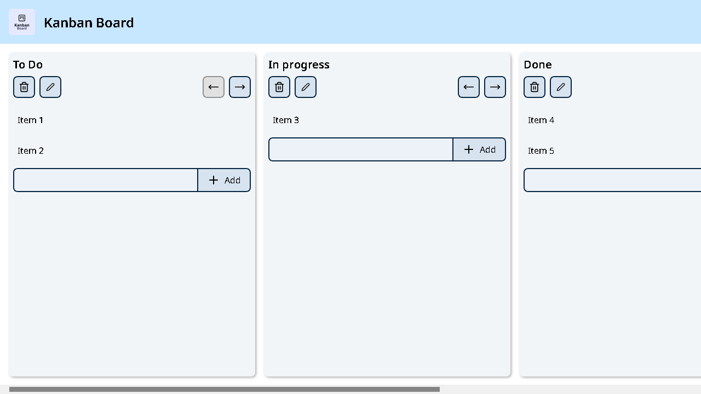
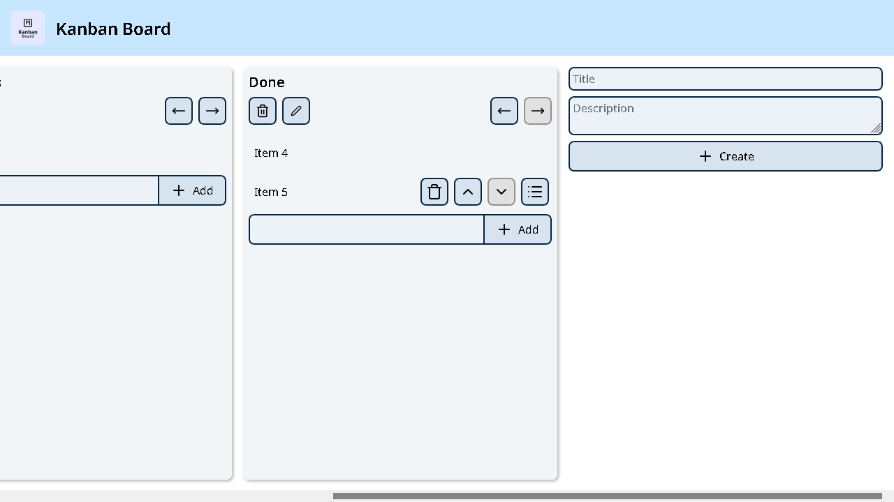
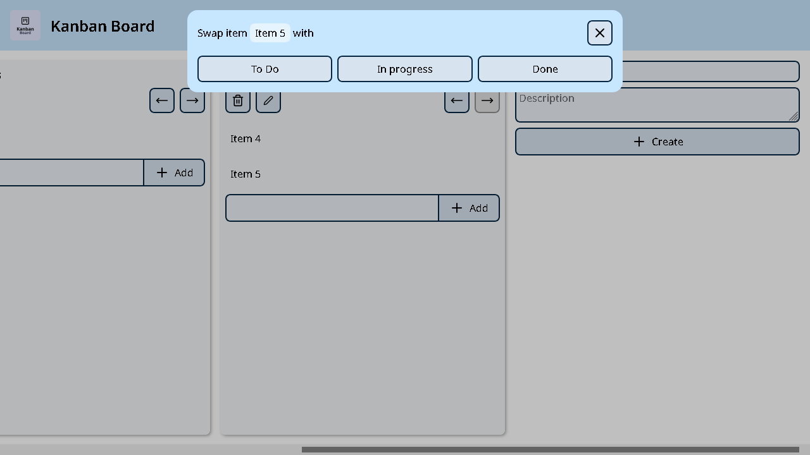

# React TypeScript Kanban Board


[](https://skillicons.dev)

A Kanban board application built with React and TypeScript.

Create, edit, delete, and reorder boards and tasks. Each task can also be moved between boards, and all changes are automatically saved using Local Storage.

Live demo: https://giovannieliasdarosa.github.io/react-typescript-kanban-board/

## Contents

- [Screenshots](#screenshots)
- [Features](#features)
- [Tech Stack](#tech-stack)
- [Architecture](#architecture)
- [Project layout](#project-layout)
- [How to run locally](#how-to-run-locally)
- [About](#about)

## Screenshots





## Features

- Create, edit and delete boards
- Create, edit and delete tasks
- Move boards left and right
- Expand and collapse board descriptions
- Move tasks within a board
- Move tasks between boards
- Automatic persistence using Local Storage

## Tech Stack

- React 19
- TypeScript
- Vite
- React Router
- CSS Modules
- Lucide React

## Architecture

This application uses React Context with `useReducer` for state management. All board operations are handled through reducer actions, while the board state is persisted in Local Storage.

## Project layout

- **src/**
  - main.tsx
  - **app/**
  - **components/**
  - **contexts/**
  - **features/**
    - **home/**
  - **styles/**
  - **types/**

## How to run locally

### Prerequisites

- Node.js (includes npm)

### Clone repository

1. Clone this repository and unzip it
2. Open the folder in a terminal

### Install packages

1. Install dependencies

```bash
npm install
```

2. Run the dev server

```bash
npm run dev
```

## About

This project was built to put my TypeScript knowledge into practice. After seeing many tutorials in TypeScript, I wanted to challenge myself by building a complete application.

The focus of this project was learning how to structure a React application with TypeScript, while using strict typing throughout the project. It taught me a lot about state management, component organization, and writing safer, more maintainable code.
